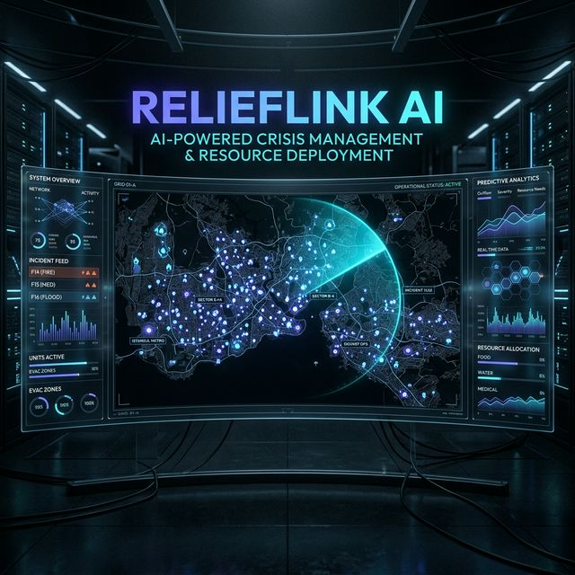
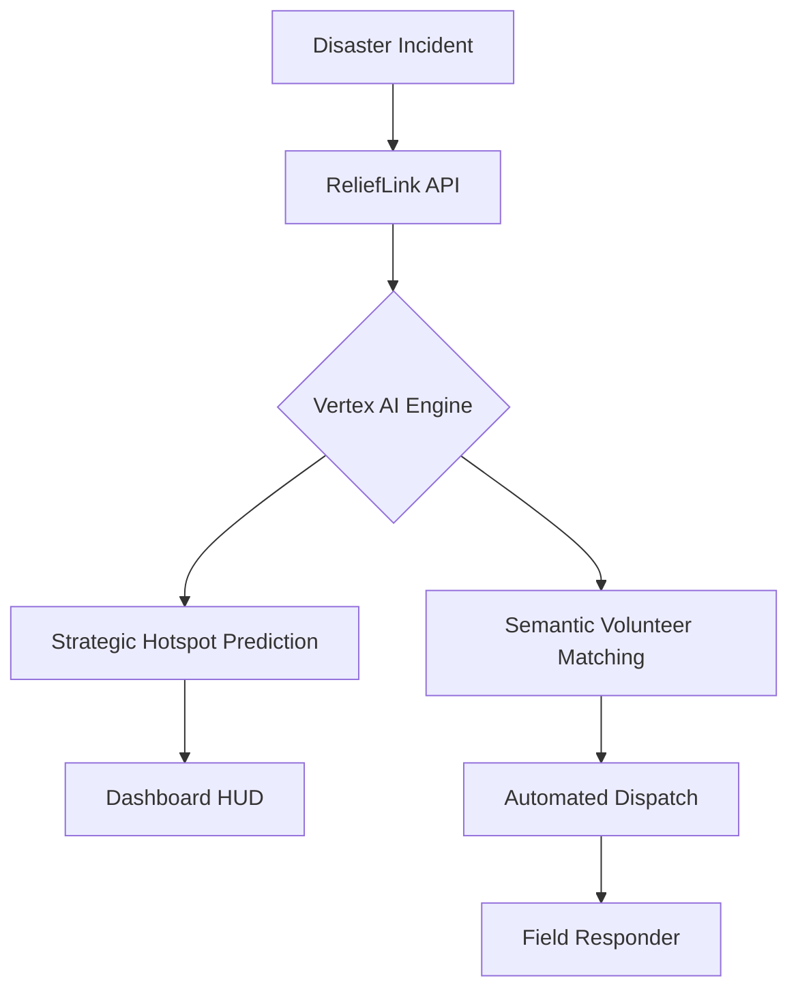

# 🛰️ ReliefLink AI: The Autonomous Command Center



### **Scaling Global Disaster Response with Google Cloud Vertex AI**

ReliefLink AI is a high-fidelity, autonomous disaster coordination platform designed to eliminate response delays and centralize field intelligence. By leveraging Google Cloud's **Vertex AI**, we transition disaster management from *reactive* to *predictive*.

---

## 🌍 UN Sustainable Development Goal Alignment
ReliefLink AI is built to contribute directly to the United Nations SDGs:
- **SDG 11: Sustainable Cities and Communities**: Enhancing disaster resilience and protecting the vulnerable.
- **SDG 13: Climate Action**: Strengthening adaptive capacity to climate-related hazards and natural disasters.

---

## 🚀 Core Features
### 📡 Elite GIS Situational Awareness
- **Tactical HUD**: 50px coordinate grid precision with real-time GPS telemetry.
- **Satellite Radar Sweep**: Animated sonar scanning for live data refresh simulation.
- **Crisis Heat Zones**: Pulsing radial heatmaps for high-urgency incident clusters.

### 🧠 Strategic Intelligence Engine
- **Predictive Analytics**: Uses **Vertex AI (Gemini 1.5 Flash)** to analyze incident density and forecast resource gaps.
- **Autonomous Dispatch**: Semantically matches responder skills to incident complexity via advanced LLM reasoning.

### 💎 High-Fidelity UX
- **Indigo Design System**: Premium glassmorphism with `25px` backdrop blurring and custom 'Outfit' typography.
- **Real-time Tactical Feed**: Sub-second updates for incident tracking and deployment.

---

## 🛠️ Technical Stack
- **Framework**: [Next.js](https://nextjs.org/) (React 19)
- **AI Engine**: [Google Cloud Vertex AI](https://cloud.google.com/vertex-ai) (Gemini 1.5 Flash)
- **Styling**: Vanilla CSS (High-performance Glassmorphism)
- **State Management**: React Hooks + In-memory store logic
- **Package Manager**: NPM

---

## 🏗️ Architecture


---

## 🚦 Getting Started
### 1. Prerequisites
- Node.js 18+
- A Google Cloud Project with **Vertex AI API** enabled.

### 2. Installation
```bash
git clone https://github.com/vaishnavi-ctrl-jpg/RELIEFLINK-AI-
cd RELIEFLINK-AI-
npm install
```

### 3. Environment Setup
Create a `.env.local` file with the following:
```bash
GOOGLE_CLOUD_PROJECT=your-project-id
GOOGLE_CLOUD_LOCATION=us-central1
GOOGLE_APPLICATION_CREDENTIALS=./service-account-key.json
```

### 4. Run Development Server
```bash
npm run dev
```

---

## 🎖️ The Vision
ReliefLink AI aims to be the open-source standard for crisis coordination, using cutting-edge Google technologies to ensure that no call for help goes unanswered.

**Developed for the Google Solution Challenge 2026.**
